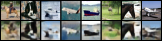
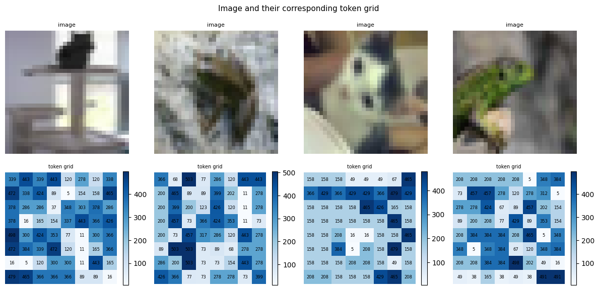

# Autoregressive Image Generation — VQ-VAE + GPT (CIFAR-10)

Implementation of a two-stage autoregressive image generation pipeline trained on CIFAR-10. Instead of generating the entire image at once like diffusion models, an autoregressive model generates one token at a time — similar to how transformers generate text.

---

## Pipeline

```
CIFAR-10 image (32, 32, 3)
    → Encoder CNN         → (8, 8, 256)
    → Codebook lookup     → (8, 8) indices
    → Flatten             → 64 integer tokens
    → Transformer         → next token prediction
    → Sample 64 tokens    → autoregressively
    → Codebook vectors    → (8, 8, 256)
    → Decoder CNN         → (32, 32, 3)
```

---


## Results

### VQ-VAE Reconstruction

Original images (top row) vs reconstructed images (bottom row) at epoch 41:



---

### Image → Token Grid

Each CIFAR-10 image compressed to an 8×8 grid of codebook indices. These integer grids are what the transformer trains on:



---

## Architecture

### Phase 1 — VQ-VAE

The VQ-VAE compresses images into discrete token sequences via a learned codebook.

**Encoder** — CNN that downsamples `(32, 32, 3)` → `(8, 8, 256)` via two strided convolutions. Each of the 64 spatial locations produces a 256-dim latent vector.

**Codebook** — Learnable lookup table of shape `(512, 256)`. For each latent vector, the nearest codebook entry is found via L2 distance and its index becomes the token.

```
||z - e||² = ||z||² + ||e||² - 2·z·eᵀ
```

**Decoder** — Mirror of the encoder. Takes the `(8, 8, 256)` grid of quantized vectors and upsamples back to `(32, 32, 3)` via transposed convolutions.

**Three losses:**

| Loss | Formula | Updates |
|------|---------|---------|
| Reconstruction | `MSE(x_recon, x)` | Encoder + Decoder |
| Codebook | `MSE(sg(z_e), z_q)` | Codebook only |
| Commitment | `MSE(z_e, sg(z_q))` | Encoder only |

```
total_loss = reconstruction + codebook + β × commitment     β = 0.25
```

The straight-through estimator is used to pass gradients through the non-differentiable argmin:
```
z_q_st = z_e + (z_q - z_e).detach()
```

---

### Phase 2 — Autoregressive Transformer (GPT-style)

A decoder-only transformer trained on token sequences produced by the frozen VQ-VAE.

**Architecture:**

| Component | Detail |
|-----------|--------|
| Vocabulary | 513 (512 codebook + 1 BOS) |
| Sequence length | 65 (BOS + 64 image tokens) |
| d_model | 256 |
| n_heads | 8 |
| n_layers | 6 |
| d_ff | 1024 |
| Dropout | 0.1 |

**Training:** Standard next-token prediction with cross-entropy loss and teacher forcing. All 64 positions trained in one parallel forward pass.

```
input:  [BOS, t0, t1, ... t62]   (B, 65)
target: [t0,  t1, t2, ... t63]   (B, 64)
loss:   cross_entropy(logits[:, :-1, :], target)
```

**Inference:** Autoregressive sampling — 64 sequential forward passes, one token per step.

```
[BOS] → t0 → [BOS, t0] → t1 → ... → [BOS, t0...t63]
```

---

## Project Structure

```
vqvae_ar/
├── models/
│   ├── encoder.py           ← CNN encoder
│   ├── codebook.py          ← VQ codebook with straight-through estimator
│   ├── decoder.py           ← CNN decoder
│   ├── vqvae.py             ← Full VQ-VAE with losses
│   └── GPT.py               ← CausalSelfAttention + TransformerBlock + GPT
├── training/
│   ├── train_vqvae.py       ← VQ-VAE training loop
│   └── train_transformer.py ← Transformer training loop
├── data/
│   ├── dataset.py           ← CIFAR-10 dataloader
│   └── token_dataset.py     ← Tokenization + token sequence dataset
├── train_vqvae.py           ← Entry point: phase 1
├── train_transformer.py     ← Entry point: phase 2
└── generate.py              ← Sample new images
```

---

## Usage

**Setup:**
```bash
python3 -m venv venv
source venv/bin/activate
pip install torch torchvision numpy matplotlib tqdm mlflow scikit-learn
```

**Phase 1 — Train VQ-VAE:**
```bash
python train_vqvae.py
```

**Phase 2 — Train Transformer:**
```bash
python train_transformer.py
```

**Generate images:**
```bash
python generate.py
```

**Track experiments:**
```bash
mlflow ui      # open http://localhost:5000
```


---

## Experiments & Observations

Transformer Loss Progression

| Epoch | Train Loss |
|-------|-----------|
| 1 | ~6.24 |
| 10 | ~3.8 |
| 20 | ~2.8 |
| 30 | ~2.45 |
| 40 | ~2.33 |
| 50 | ~2.27 |


---

## References

- van den Oord et al. (2017) — [Neural Discrete Representation Learning (VQ-VAE)](https://arxiv.org/abs/1711.00937)
- Razavi et al. (2019) — [Generating Diverse High-Fidelity Images with VQ-VAE-2](https://arxiv.org/abs/1906.00446)